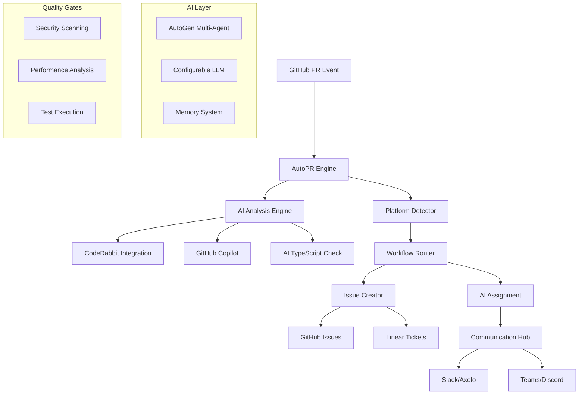

# AutoPR Engine 🤖

## AI-Powered GitHub PR Automation and Issue Management

[](https://badge.fury.io/py/autopr-engine)
[](https://www.python.org/downloads/)
[](https://opensource.org/licenses/MIT)
[](https://github.com/marketplace/autopr-engine)

[](https://github.com/JustAGhosT/autopr-engine/actions?query=workflow%3ACI)
[](https://github.com/JustAGhosT/autopr-engine/actions?query=workflow%3A%22Quality+Feedback%22)
[](https://github.com/JustAGhosT/autopr-engine/actions?query=workflow%3A%22PR+Checks%22)

AutoPR Engine is a comprehensive AI-powered automation platform that transforms GitHub pull request
workflows through intelligent analysis, issue creation, and multi-agent collaboration.

> **📢 Repository Structure Update**: The repository has been reorganized for better maintainability
> and developer experience. See [Reorganization Summary](REORGANIZATION_SUMMARY.md) for
> details on the improvements.

---

## 📁 **Repository Structure**

The AutoPR Engine repository is organized for optimal developer experience and maintainability:

```text
.
├── docs/                      # 📚 All documentation
│   ├── getting-started/       # Setup and quick start guides
│   ├── development/           # Development guides and tools
│   ├── architecture/          # System architecture documents
│   ├── plans/                 # Project planning documents
│   └── README.md              # Documentation index
├── configs/                   # ⚙️ Configuration files
│   ├── platforms/             # Platform configurations
│   ├── workflows/             # Workflow configurations
│   ├── phases/                # Phase configurations
│   └── tasks/                 # Task configurations
├── templates/                 # 🎨 Template system
│   ├── platforms/             # Platform-specific templates
│   ├── use-cases/             # Use case templates
│   ├── deployment/            # Deployment templates
│   └── integrations/          # Integration templates
├── tools/                     # 🔧 Development tools
│   ├── development/           # Development workflow tools
│   └── quality/               # Code quality tools
└── autopr/                    # 🚀 Main source code
```

---

## 🌟 **Features**

### **🤖 AI-Powered PR Analysis**

- **Multi-Agent Review**: CodeRabbit, GitHub Copilot, AI TypeScript Check integration
- **Platform Detection**: Detects 25+ development platforms (Replit, Bolt, Lovable, etc.)
- **Intelligent Issue Classification**: Security, performance, bugs, features
- **Quality Gates**: Automated validation before merge

### **🔗 Smart Integrations**

- **Communication**: Slack (Axolo), Microsoft Teams, Discord, Notion
- **Project Management**: Linear, GitHub Issues, Jira
- **AI Tools**: AutoGen multi-agent, configurable LLM providers
- **Monitoring**: Sentry, DataDog, Prometheus metrics

### **⚡ Advanced Automation**

- **Issue Auto-Creation**: GitHub Issues and Linear tickets
- **AI Tool Assignment**: Route issues to specialized AI tools
- **Workflow Orchestration**: 20+ pre-built workflows
- **Memory System**: Learn from past interactions and patterns

---

## 🚀 **Quick Start**

### **Installation**

```bash
# Install from PyPI
pip install autopr-engine

# Or install with all features
pip install "autopr-engine[full]"

# Docker deployment (build locally)
docker build -t autopr-engine:latest .
docker run -d \
  -e GITHUB_TOKEN=your_token \
  -e OPENAI_API_KEY=your_key \
  -p 8080:8080 \
  YOUR_DOCKERHUB_USERNAME/autopr-engine:latest

# Docker Compose deployment (recommended for full setup)
# Create a .env file with your environment variables:
# GITHUB_TOKEN=your_token
# OPENAI_API_KEY=your_key
# Then run:
docker-compose up -d

# Publishing to GitHub Container Registry (GHCR)
# 1. Build the image:
docker build -t autopr-engine:latest .

# 2. Tag for GHCR (replace YOUR_USERNAME with your GitHub username):
docker tag autopr-engine:latest ghcr.io/YOUR_USERNAME/autopr-engine:latest

# 3. Authenticate to GHCR:
docker login ghcr.io -u YOUR_USERNAME -p YOUR_GITHUB_TOKEN

# 4. Push to GHCR:
docker push ghcr.io/YOUR_USERNAME/autopr-engine:latest

# 5. Run the published image:
docker run -d \
  -e GITHUB_TOKEN=your_token \
  -e OPENAI_API_KEY=your_key \
  -p 8080:8080 \
  ghcr.io/YOUR_USERNAME/autopr-engine:latest

# Publishing to Docker Hub (alternative)
# 1. Build and tag for Docker Hub:
docker build -t YOUR_DOCKERHUB_USERNAME/autopr-engine:latest .

# 2. Authenticate to Docker Hub:
docker login -u YOUR_DOCKERHUB_USERNAME -p YOUR_DOCKERHUB_TOKEN

# 3. Push to Docker Hub:
docker push YOUR_DOCKERHUB_USERNAME/autopr-engine:latest

# 4. Run the published image:
docker run -d \
  -e GITHUB_TOKEN=your_token \
  -e OPENAI_API_KEY=your_key \
  -p 8080:8080 \
  YOUR_DOCKERHUB_USERNAME/autopr-engine:latest
```

### **Basic Configuration**

```python
# autopr_config.py
from autopr import AutoPREngine

# Initialize engine
engine = AutoPREngine({
    'github_token': 'your_github_token',
    'openai_api_key': 'your_openai_key',
    'repositories': ['owner/repo'],
    'integrations': {
        'slack': {
            'webhook_url': 'your_slack_webhook',
            'channel': '#pr-reviews'
        },
        'linear': {
            'api_key': 'your_linear_key',
            'team_id': 'your_team_id'
        }
    }
})

# Start processing
await engine.start()
```

### **GitHub Action Integration**

```yaml
# .github/workflows/autopr.yml
name: AutoPR Analysis
on:
  pull_request:
    types: [opened, synchronize]

jobs:
  autopr:
    runs-on: ubuntu-latest
    steps:
      - uses: actions/checkout@v4
      - uses: JustAGhosT/autopr-engine@v0.0.1
        with:
          github-token: ${{ secrets.GITHUB_TOKEN }}
          openai-api-key: ${{ secrets.OPENAI_API_KEY }}
          linear-api-key: ${{ secrets.LINEAR_API_KEY }}
```

---

## 📖 **Documentation**

### **Core Concepts**

- [**Architecture Overview**](docs/architecture/README.md) - System design and components
- [**Enhanced System Architecture**](docs/architecture/AUTOPR_ENHANCED_SYSTEM.md) - Comprehensive
  system design
- [**Quality Engine**](docs/development/ai_linting_fixer.md) - AI-powered code analysis
- [**Development Guide**](docs/development/) - Development setup and tools

### **Platform-Specific Guides**

- [**Platform Detection**](docs/development/platform_detection.md) - Platform identification system
- [**Windows Development**](docs/development/WINDOWS_DEVELOPMENT.md) - Windows development setup
- [**Code Quality**](docs/development/CODE_QUALITY.md) - Code quality standards
- [**Configuration Management**](docs/development/CONFIGURATION_EXTRACTION.md) - Configuration
  system

### **Advanced Topics**

- [**Python 3.13 Upgrade**](docs/development/PYTHON_313_UPGRADE.md) - Python upgrade guide
- [**Modular Refactoring**](docs/development/MODULAR_REFACTORING_SUMMARY.md) - Refactoring
  documentation
- [**AutoWeave Integration**](docs/development/autopr_autoweave_integration.md) - Integration guide
- [**Migration Guide**](docs/getting-started/MIGRATION_GUIDE.md) - Migration from previous versions

---

## 🏗️ **Architecture**



---

## 🛠️ **Development**

### **Setup Development Environment**

```bash
# Clone repository
git clone https://github.com/JustAGhosT/autopr-engine.git
cd autopr-engine  # or 'cd autopr' if repository is cloned as 'autopr'

# Create virtual environment
python -m venv venv
source venv/bin/activate  # On Windows: venv\Scripts\activate

# Install in development mode
pip install -e ".[dev]"

# Run tests
pytest

# Run with live reload
python -m autopr.server --reload
```

### **Project Structure**

```text
.
├── autopr/                 # Core engine package
│   ├── actions/            # Automation actions
│   ├── agents/             # Agent system
│   ├── ai/                 # AI and LLM components
│   ├── cli/                # Command-line interface
│   ├── clients/            # External service clients
│   ├── config/             # Configuration management
│   ├── integrations/       # External service integrations
│   ├── quality/            # Quality gates and validation
│   ├── security/           # Security framework
│   ├── workflows/          # Pre-built workflow definitions
│   └── engine.py           # Core engine
├── tests/                  # Comprehensive test suite
├── docs/                   # Documentation
│   ├── architecture/       # System architecture
│   ├── development/        # Development guides
│   ├── getting-started/    # Setup guides
│   └── plans/              # Project planning
├── configs/                # Configuration files
│   ├── platforms/          # Platform configurations
│   └── workflows/          # Workflow configurations
├── templates/              # Template system
│   ├── platforms/          # Platform-specific templates
│   ├── deployment/         # Deployment templates
│   └── use-cases/          # Use case templates
├── tools/                  # Development tools
│   ├── development/        # Development workflow tools
│   └── quality/            # Code quality tools
├── scripts/                # Utility scripts
├── examples/               # Usage examples
├── setup.py                # Package configuration
├── pyproject.toml          # Modern Python packaging
├── Dockerfile              # Container build
├── docker-compose.yml      # Local development
└── README.md              # This file
```

### **Testing**

```bash
# Run all tests
pytest

# Run with coverage
pytest --cov=autopr --cov-report=html

# Run specific test categories
pytest tests/actions/      # Action tests
pytest tests/workflows/    # Workflow tests
pytest tests/integration/  # Integration tests

# Run performance tests
pytest tests/performance/ -v
```

---

## 🔧 **Configuration**

### **Environment Variables**

```bash
# Core Configuration
GITHUB_TOKEN=ghp_xxxxxxxxxxxx           # GitHub API token
OPENAI_API_KEY=sk-xxxxxxxx              # OpenAI API key
AUTOPR_LOG_LEVEL=INFO                   # Logging level

# Optional AI Providers
ANTHROPIC_API_KEY=sk-ant-xxxxxxxx       # Claude API key
MISTRAL_API_KEY=xxxxxxxx                # Mistral API key
GROQ_API_KEY=gsk_xxxxxxxx               # Groq API key

# Integrations
SLACK_WEBHOOK_URL=https://hooks.slack.com/...  # Slack notifications
LINEAR_API_KEY=lin_api_xxxxxxxx         # Linear integration
AXOLO_WORKSPACE_URL=https://...         # Axolo integration

# Infrastructure
REDIS_URL=redis://localhost:6379        # Caching and state
DATABASE_URL=postgresql://...           # PostgreSQL database
SENTRY_DSN=https://...                  # Error tracking
```

### **Configuration File**

```yaml
# autopr.yml
repositories:
  - owner: JustAGhosT
    repos: ["vv-landing", "vv-backend"]

workflows:
  - name: "pr_review_analysis"
    triggers: ["pull_request.opened", "pull_request.synchronize"]
    actions:
      - platform_detector
      - ai_analysis
      - issue_creator
      - team_notification

integrations:
  slack:
    enabled: true
    channels:
      pr_reviews: "#pr-reviews"
      security_alerts: "#security"

  linear:
    enabled: true
    team_id: "VV"
    project_templates:
      security: "Security Issues"
      performance: "Performance Optimization"

ai_providers:
  default: "openai"
  fallback_order: ["openai", "anthropic", "mistral"]
  models:
    openai: "gpt-4"
    anthropic: "claude-3-sonnet-20240229"
```

---

## 🔌 **Integrations**

### **Communication Platforms**

- **Slack** - Channel automation with Axolo
- **Microsoft Teams** - Enterprise communication
- **Discord** - Community-focused teams
- **Notion** - Documentation automation

### **Project Management**

- **Linear** - Modern issue tracking
- **GitHub Issues** - Native GitHub integration
- **Jira** - Enterprise project management

### **AI & Development Tools**

- **CodeRabbit** - AI code review
- **GitHub Copilot** - AI coding assistant
- **AutoGen** - Multi-agent collaboration
- **Platform Detection** - Supports 25+ development platforms including Replit, Bolt, Lovable, and more

---

## 📊 **Monitoring & Observability**

### **Built-in Metrics**

- PR processing times and success rates
- AI tool performance and accuracy
- Issue creation and resolution tracking
- Integration health monitoring

### **Supported Monitoring**

- **Prometheus** metrics collection
- **Grafana** dashboards
- **Sentry** error tracking
- **DataDog** APM integration
- **Custom webhooks** for external systems

---

## 📚 **Documentation & Resources**

### **Comprehensive Documentation**

AutoPR Engine provides extensive documentation covering all aspects of the project:

#### **Analysis & Planning**
- **[Comprehensive Project Analysis](docs/COMPREHENSIVE_PROJECT_ANALYSIS.md)** - Complete production-readiness assessment
  - Business context and strategic goals
  - Technology stack inventory (Python 3.12+, FastAPI, React/Tauri)
  - 9 bugs, 9 UI/UX improvements, 9 performance enhancements identified
  - 3 high-value feature proposals
  - 5-phase implementation roadmap (15 weeks)

#### **Design & UX**
- **[Design System](docs/design/README.md)** - Complete visual identity and component library
  - Color palette with WCAG 2.1 AA compliance
  - Typography hierarchy and spacing system
  - Accessible component patterns
  - Dark mode implementation guide

#### **Operations & Support**
- **[Troubleshooting Guide](docs/TROUBLESHOOTING.md)** - Comprehensive problem-solving resource
  - 9 common error scenarios with solutions
  - Installation, configuration, and runtime issues
  - Performance debugging and optimization
  - Health check scripts and emergency contacts

- **[Security Best Practices](docs/security/SECURITY_BEST_PRACTICES.md)** - Enterprise security guide
  - Authentication and authorization
  - Secret management with vault integration
  - Secure deployment configurations
  - API security and rate limiting
  - Compliance (GDPR, SOC 2)

#### **Implementation & Development**
- **[Implementation Summary](docs/IMPLEMENTATION_SUMMARY_POC.md)** - POC implementation details
  - Critical security fixes (race conditions, input validation)
  - Test coverage metrics (29 tests, 100% passing)
  - Production hardening checklist

- **[Completion Summary](docs/COMPLETION_SUMMARY.md)** - Full project status
  - All deliverables completed
  - Success criteria met
  - Next steps and recommendations

### **Recent Security Enhancements** 🔒

The following critical security improvements have been implemented:

#### **BUG-2: Race Condition Fix** ✅
- **Issue:** Concurrent access to workflow metrics without lock protection
- **Solution:** Async lock implementation for all metrics operations
- **Testing:** 8 comprehensive async tests validating thread safety
- **Impact:** Eliminated data corruption risk in production

#### **BUG-3: Input Validation** ✅
- **Issue:** Missing validation allowed injection attacks
- **Solution:** Comprehensive validation module with Pydantic
- **Security:** Prevents SQL injection, XSS, command injection, path traversal
- **Testing:** 21 security tests covering attack scenarios
- **Patterns:** 12 suspicious patterns detected (script tags, eval, etc.)

#### **BUG-6: Directory Traversal Prevention** ✅
- **Issue:** Path traversal vulnerability in dashboard
- **Solution:** Whitelist-based path validation with symlink prevention
- **Testing:** 17 security tests for common attack vectors
- **Status:** Verified secure implementation

### **Test Coverage**

Comprehensive test suite ensuring code quality and security:

```bash
# Run all tests
pytest

# Run security tests
pytest tests/test_workflow_validation.py
pytest tests/test_workflow_engine_critical.py
pytest tests/test_dashboard_security.py

# Check coverage
pytest --cov=autopr --cov-report=html
```

**Current Coverage:**
- Security tests: 29 (100% passing)
- Total test files: 115+
- Critical components: Fully covered

### **Technology Stack**

**Backend:**
- Python 3.12+ (targeting 3.13)
- FastAPI (REST API), Flask (Dashboard)
- SQLAlchemy 2.0 (PostgreSQL, SQLite)
- Redis (caching), Alembic (migrations)
- Pydantic 2.9.0+ (validation)

**Frontend:**
- React 18+ with TypeScript
- Tauri (desktop framework)
- Tailwind CSS 3.x
- shadcn/ui components
- Vite (build tool)

**AI/LLM:**
- OpenAI (GPT-4)
- Anthropic (Claude)
- Mistral AI, Groq
- Multi-provider fallback system

**Infrastructure:**
- Docker & Kubernetes
- GitHub Actions (CI/CD)
- OpenTelemetry (monitoring)
- Prometheus & Grafana

### **Known Limitations**

- Workflow execution timeout: 300 seconds (configurable)
- Workflow history limit: 1000 entries (prevents memory leaks)
- String parameter limit: 10,000 characters (security)
- Nesting depth limit: 10 levels (DoS prevention)
- Rate limits: Dependent on GitHub/LLM provider limits

### **Planned Enhancements**

**Short-term (Weeks 1-4):**
- Database connection pooling optimization
- Additional database indexes
- API reference documentation
- Deployment playbooks

**Medium-term (Weeks 4-8):**
- WCAG 2.1 AA compliance improvements
- Performance benchmarking suite
- Accessibility compliance review

**Long-term (Weeks 8-15):**
- Real-time collaboration features
- AI-powered code suggestion engine
- Workflow analytics dashboard

See [Comprehensive Analysis](docs/COMPREHENSIVE_PROJECT_ANALYSIS.md) for complete roadmap.

---

## 🤝 **Contributing**

We welcome contributions! Please see our [Contributing Guide](CONTRIBUTING.md) for details.

### **Development Workflow**

AutoPR Engine uses a **volume-aware, multi-stage workflow system** for automated quality checks:

#### **Workflow Stages**

1. **PR-Checks** (Ultra-fast validation)
   - Runs immediately on PR creation/update
   - Pre-commit hooks on changed files only
   - Minimal tests for draft PRs
   - 10-minute timeout for quick feedback

2. **Quality Feedback** (Detailed PR feedback)
   - Pre-commit hooks on all files
   - Security scanning (Bandit + Safety)
   - Detailed PR comments with reports
   - Artifact uploads for security reports

3. **CI** (Comprehensive checks)
   - Volume-aware conditional execution
   - Full test suite with coverage
   - Type checking (MyPy)
   - Linting (Ruff) with volume-based rules
   - Security checks (volume ≥ 600)

4. **Background Fixer** (Maintenance)
   - Scheduled daily runs
   - Automated code fixing
   - Volume-aware fix aggressiveness

#### **Volume System**

The workflow system uses a volume-based approach (0-1000) to determine check intensity:

- **0-199:** Tests only
- **200-399:** Tests + relaxed linting
- **400-599:** Tests + linting + type checking
- **600+:** All checks including security

#### **Contributing Steps**

1. Fork the repository
2. Create a feature branch (`git checkout -b feature/amazing-feature`)
3. Make your changes
4. Add tests for new functionality
5. Run the test suite (`pytest`)
6. Commit your changes (`git commit -m 'Add amazing feature'`)
7. Push to the branch (`git push origin feature/amazing-feature`)
8. Open a Pull Request

**Note:** The workflow system will automatically run appropriate checks based on your PR and
repository volume settings. See [Workflow Documentation](.github/workflows/README.md) for detailed
information.

### **Code Standards**

- Follow [PEP 8](https://peps.python.org/pep-0008/) style guidelines
- Add type hints for all functions
- Write comprehensive tests for new features
- Update documentation for user-facing changes

---

## 📝 **License**

This project is licensed under the MIT License - see the [LICENSE](LICENSE) file for details.

---

## 🙏 **Acknowledgments**

- **AutoGen** team for multi-agent AI framework
- **CodeRabbit** for AI code review integration
- **Axolo** team for Slack PR automation
- **GitHub** for the platform and APIs
- **OpenAI** and **Anthropic** for AI capabilities
- All our **contributors** and **community members**

---

## 📞 **Support**

- **Documentation**: [https://autopr-engine.readthedocs.io](https://autopr-engine.readthedocs.io)
- **GitHub Issues**: [Report bugs and request features](https://github.com/JustAGhosT/autopr-engine/issues)
- **Discussions**: [Community discussions](https://github.com/JustAGhosT/autopr-engine/discussions)
- **Email**: [support@justaghost.com](mailto:support@justaghost.com)

---

## Made with ❤️ by JustAGhosT
